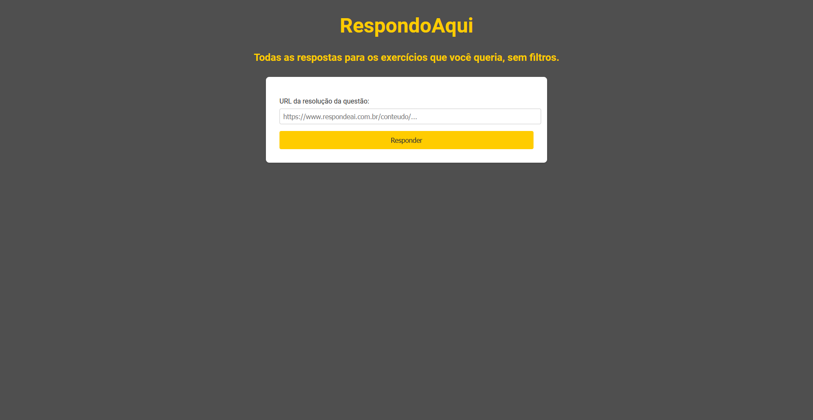

# RespondoAqui

Uma forma fácil de visualizar a resolução de questões do RespondeAí gratuitamente sem as respostas borradas.

O site hospedado na Vercel está fora do ar (não sei o motivo), mas o projeto ainda funciona localmente. Basta clonar o respositório e abrir o HTML.

